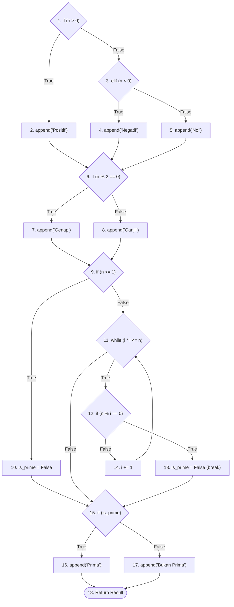

# Laporan Tugas Whitebox Testing

## 1. Source Code Program
File source code telah dibuat dengan nama `number_analyzer.py`. Program ini dirancang untuk mendeteksi tiga sifat bilangan secara sekaligus:
- Positif, Negatif, atau Nol
- Genap atau Ganjil
- Prima atau Bukan Prima

Struktur kode memiliki `while loop` dan beberapa percabangan `if-else` bertingkat, menjadikannya cukup kompleks dan cocok untuk analisis pemahaman mendalam *Whitebox Testing*.

## 2. Gambaran Flow Graph
Berikut adalah *Flow Graph* dari program `number_analyzer.py` berdasarkan simpul (node) yang telah ditandai di dalam *source code*:

## 3. Perhitungan Cyclomatic Complexity (CC)

Nilai Cyclomatic Complexity (V(G)) menentukan batas metrik maksimum *path independen* yang wajib diuji agar mencapai target pengujian *100% Branch Coverage*.

- **Metode 1: Berdasarkan Edge dan Node**
  Rumus: `V(G) = E - N + 2`
  - Jumlah Garis/Edge (E) = 24
  - Jumlah Simpul/Node (N) = 18
  - `V(G) = 24 - 18 + 2 = 8`

- **Metode 2: Berdasarkan Predicate Node (Simpul Keputusan)**
  Rumus: `V(G) = P + 1`
  - Jumlah *Predicate Node* / *Decision Node* (P) = 7 (yaitu Node 1, 3, 6, 9, 11, 12, dan 15)
  - `V(G) = 7 + 1 = 8`

Kesimpulan: **Cyclomatic Complexity program ini adalah 8.**

## 4. Independent Paths (Basis Paths) dan Test Cases

Berdasarkan nilai CC = 8, kita memiliki tepat **8 jalur eksekusi independen**. Setiap jalur ini bersifat independen karena minimum melewati satu ruas garis (*edge*) yang sebelumnya belum pernah dilewati oleh jalur lainnya. 

Berikut adalah penjabarannya beserta contoh input (*Test Case*) yang sudah tertuang pada program `number_analyzer.py`:

| Path | Jalur Node Eksekusi | Test Case | Keterangan Alur Program |
|------|---------------------|-----------|-------------------------|
| **1** | `1 -> 3 -> 5 -> 6 -> 7 -> 9 -> 10 -> 15 -> 17 -> 18` | `n = 0` | Nol, Genap, Bukan Prima |
| **2** | `1 -> 3 -> 4 -> 6 -> 8 -> 9 -> 10 -> 15 -> 17 -> 18` | `n = -3` | Negatif, Ganjil, Bukan Prima |
| **3** | `1 -> 3 -> 4 -> 6 -> 7 -> 9 -> 10 -> 15 -> 17 -> 18` | `n = -2` | Negatif, Genap, Bukan Prima |
| **4** | `1 -> 2 -> 6 -> 8 -> 9 -> 10 -> 15 -> 17 -> 18` | `n = 1` | Positif, Ganjil, Bukan Prima |
| **5** | `1 -> 2 -> 6 -> 7 -> 9 -> 11 -> 15 -> 16 -> 18` | `n = 2` | Positif, Genap, Prima (Loop Langsung Skip) |
| **6** | `1 -> 2 -> 6 -> 8 -> 9 -> 11 -> 15 -> 16 -> 18` | `n = 3` | Positif, Ganjil, Prima (Loop Langsung Skip) |
| **7** | `1 -> 2 -> 6 -> 7 -> 9 -> 11 -> 12 -> 13 -> 15 -> 17 -> 18` | `n = 4` | Positif, Genap, Bukan Prima (Masuk Loop, di-break) |
| **8** | `1 -> 2 -> 6 -> 8 -> 9 -> 11 -> 12 -> 14 -> 11 -> 15 -> 16 -> 18` | `n = 5` | Positif, Ganjil, Prima (Iterasi Loop Normal) |

Dengan membuat 8 test cases tersebut, Anda telah berhasil menyimulasikan *100% Path Coverage* untuk program Python ini.
